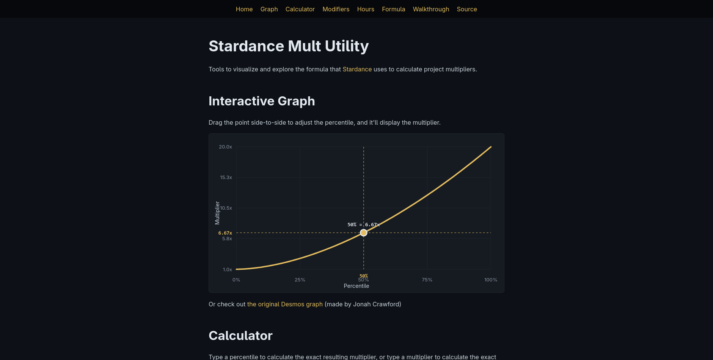

# Stardance Mult Utility

Tools to visualize and explore the formula that
[Stardance](https://stardance.hackclub.com/) uses to calculate project
multipliers.

## Quickstart

Just visit <https://ethmarks.github.io/sdmu/>

## Features

- **Exact formula reimplementation**: [`formula.ts`](./src/lib/formula.ts) is
  logically identical to
  [the official implementation](https://github.com/hackclub/stardance/blob/main/app/models/post/ship_event/payouts.rb),
  and I have [a test suite](./src/lib/formula.ts) to verify correctness.
- **Formula steps**: each step of the formula is rendered in mathematical
  notation using [MathML](https://developer.mozilla.org/en-US/docs/Web/MathML),
  to make the formula more understandable.
- **Modifiers**: modes to simulate being cursed due to bad ratings, being
  blessed due to great ratings, and the pre-July 17 mult range.
- **Code walkthrough**: excerpts of Stardance's Ruby source code, annotated with
  explanations and highlighted with [Nueglow](https://nuejs.org/docs/nueglow)
  for readability.

## Acknowledgements

- Heavily inspired by
  [this Desmos graph](https://www.desmos.com/calculator/ww5xp3gi52) made by
  [Jonah Crawford](https://github.com/Jonah-Crawford/)
- Lightly inspired by [Stardance Stats](https://stardancestats.xyz/) made by
  [Mixid](https://github.com/MIXIDtheSilly/)
- Thanks to [Hakan Alpay](https://github.com/Kimeiga) for making
  [Bahunya](https://kimeiga.github.io/bahunya/), which is used as a base for the
  site styles
- Thanks to the [NueJS team](https://github.com/nuejs) for making
  [Nueglow](https://nuejs.org/docs/nueglow), which is used for highlighting the
  code walkthrough.

## License

This project is under an MIT License. See [LICENSE](LICENSE) for more
information.
